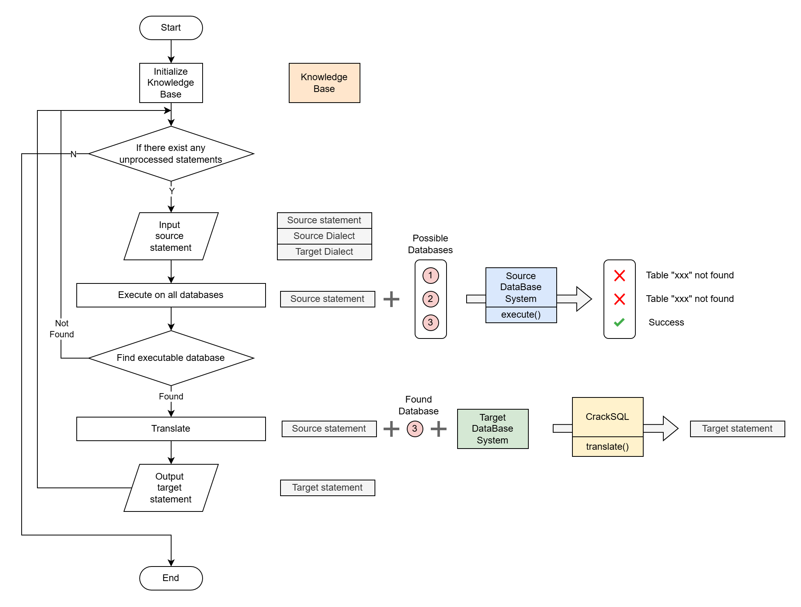

# 数据库翻译测试报告

## 1 测试方案

### 1.1 方案概述

本测试报告旨在评估 CrackSQL、jOOQ 和 SQLGlot 三种数据库方言翻译方案的效果。测试流程分为三个主要步骤：环境准备、翻译执行和结果检验。

首先，我们将搭建必要的代码运行环境和数据库系统。随后，对三种翻译方案进行实测，记录其翻译结果。最后，我们将从多个维度对翻译结果进行严格检验，包括翻译后的 SQL 语句能否无误执行，以及源方言和目标方言的 SQL 语句在功能上是否等效（涵盖 DQL 查询结果和 DML 修改结果的一致性）。

### 1.2 准备环境

我们将配置一个基于 Python 的运行环境，它在 CrackSQL 的默认环境基础上进行了优化。考虑到测试主要通过 API 调用大型语言模型（LLM）和 Embedding 模型，我们移除了 PyTorch 及其相关依赖（如 `transformers `库），并新增了测试所需的库，例如 `pandas` 和 `pillow`，以及用于支持阿里云 API 的 dashscope。

数据库系统测试环境将主要通过 Docker 搭建，核心组件是 MySQL 8.4.0 和 PostgreSQL 14.18。我们对 Bird Critic 数据集官方提供的 `docker-compose` 文件进行了修改，移除了测试中不需要的 Microsoft SQL 和 Oracle SQL 环境，并更新了数据库版本、账户名和密码。

最后，我们会将数据集导入到 MySQL 和 PostgreSQL 数据库中（SQLite 作为单文件数据库无需导入）。如果原始数据集仅提供 SQLite 格式，我们还会将其转换为 MySQL 和 PostgreSQL 格式，以确保数据在目标数据库中可用。

### 1.3 翻译

#### 1.3.1 CrackSQL 翻译方案

CrackSQL 的翻译流程首先涉及初始化向量知识库，其中包含了三种目标数据库系统的文档信息。

在接收到源 SQL 语句、源方言和目标方言后，由于测试数据不直接提供数据库名，我们需要通过数据库名推断来确定源 SQL 语句所对应的数据库。这一过程通过在不同可能的数据库上执行源 SQL 语句来实现，若执行成功，则认为已找到对应的数据库。

最终，我们将调用 CrackSQL 的翻译函数，传入源语句、推断出的数据库名、目标数据库系统参数以及模型参数，以获取翻译后的目标语句。

#### 1.3.2 SQLGlot 翻译方案

CrackSQL 的翻译函数内置了 SQLGlot 翻译模式（`rule_rewrite`），因此其翻译流程与 1.3.1 节所述基本一致。唯一的区别在于，在使用 SQLGlot 模式进行翻译时，无需额外提供目标数据库系统参数和模型参数。

SQLGlot 是一个轻量级的、纯 Python 实现的 SQL 解析器、转换器和优化器。与 jOOQ 专注于 Java 和类型安全的 SQL 构建不同，SQLGlot 更侧重于对 SQL 字符串本身的解析、分析和方言转换。

#### 1.3.3 jOOQ 翻译方案

我们将通过分析 jOOQ 官方翻译网站 [https://www.jooq.org/translate](https://www.jooq.org/translate) 的抓包数据，获取其 HTTP POST 接口。随后，利用 Python 的 `requests` 库调用该接口，实现自动化翻译。

具体操作是设置请求体中的 `from-dialect` `to-dialect` 和 `sql` 字段，接口将返回相应的翻译结果。

jOOQ (Java Object Oriented Querying) 是一个专为 Java 开发者设计的开源库，它提供了一种类型安全的、流畅的 API 来构建 SQL 查询。jOOQ 的核心思想是将 SQL 语句表示为 Java 对象，从而在编译时捕获潜在的 SQL 错误，并提供 IDE 自动补全等便利。

### 1.4 检验方案

检验环节的核心目标是：确认翻译后的 SQL 语句能否无报错执行，以及源方言和目标方言的 SQL 语句在功能上是否等效。等效性不仅包括 DQL 查询结果的一致性，也涵盖 DML 操作后数据库修改结果的一致性。

为此，我们首先需要设计一个通用接口，该接口能够：

1. 在指定的数据库系统上执行任意 SQL 语句。
2. 返回 DQL 语句的查询结果。
3. 获取 SQL 语句执行完成后数据库的当前数据状态。
4. 实现 SQL 语句执行效果的回退。

这个接口使用遵循 DB-API 2.0 的 Python 库来完成。`cursor.execute()` 方法用于执行 SQL 语句；`connection.rollback()` 接口将利用数据库事务机制实现操作回退；`cursor.fetchall()` 用于获取 DQL 语句的返回结果；而要获取数据库的完整数据状态，则可先通过 `SHOW TABLES` 获取所有表名，再使用 `SELECT * FROM {table_name}` 逐一查询各表数据。为便于比较，所有 SQL 语句的返回结果和数据库中的表数据都将统一转换为 `pandas.DataFrame` 类型。

为了保证结果可以比较，所有 SQL 语句的返回值和数据库中的表，都转成 `pandas.DataFrame` 类型。

下一步是利用这个接口来测量执行成功率和翻译前后的一致率。

在一致率测量中，我们首先需要比较两个执行后的数据库中的表名是否相同，然后比较每张表是否相同。这包括依次比较表的 `index`、`columns`，最后是每一行每一列的元素是否完全相等。

## 2 实验实施

在实验过程中，我们遇到了几类问题，有些已成功解决，另一些则由于数据本身的限制而难以克服。

已解决的问题：

1. DashScopeEmbedding 文本长度限制：当使用 text-embedding-v3 模型时，我们发现其支持的文本长度与代码中硬编码的长度不符。我们通过直接修改代码中的文本长度硬编码解决了这个问题。
2. `init_config.yaml` 配置不生效：修改 `init_config.yaml` 文件后，配置更改未能正确应用。我们发现删除 `instance` 文件夹可以强制系统重新加载配置，从而解决了此问题。

难以解决的问题（主要集中在数据方面）：

1. 数据集数据库格式转换困难：BookSQL、BIRD 和 Spider 数据集仅提供 SQLite 格式的数据库，但我们的实验需要其他格式。尽管我们尝试了多种转换工具，包括 SQLite 自带的 dump 工具、Python 包 sqlite3-to-mysql 以及开源数据迁移工具 PGLoader 等，但都未能成功转换。可能的原因是这些工具在处理特定数据结构或数据量时存在兼容性问题。 因此，我们最终仅在 BIRD Critic 数据集上进行了实验。值得一提的是，jOOQ 和 SQLGlot 仍然提供了在其他数据集上的翻译结果。
2. BIRD Critic 数据集在 MySQL 和 PostgreSQL 之间存在不一致：例如，`formula_1` 数据库中的 `pitstops` 表在 PostgreSQL 中名为 `pitstops`，而在 MySQL 中却名为 `pitStops`。此外，`driverstandings` 表的数据条目数量也存在不一致等问题。这些不一致性导致了几乎所有翻译结果都不正确，进而使得翻译前后的执行结果无法保持一致。

尽管存在上述挑战，我们仍旧在给定的数据集上进行了测试。测试结果总结如下：

|方案|翻译成功率|执行成功率|一致率|
|:---:|:---:|:---:|:---:|
|CrackSQL|31.58%|0.05%|0.00%|
|jOOQ|58.00%|0.00%|0.00%|
|SQLGlot|100.00%|0.00%|0.00%|

实验的复现步骤见 [README](README.md)。

## 3 在新的数据集上的实验

鉴于给定的数据集无法成功比较三种方案，我们构造了一份新的较简单的，并且能保证一致性的数据集。

